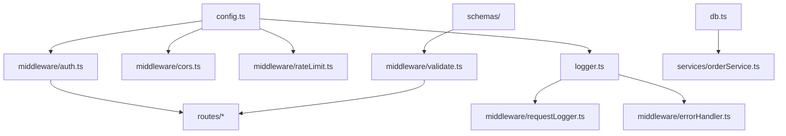

# Design Document: API Security Hardening

## Overview

This design hardens the existing Inventrix Express API for production readiness by adding a configuration module, input validation, rate limiting, CORS lockdown, structured logging, centralised error handling, JWT auth improvements, and transactional order creation. The API contract remains identical so the frontend requires no changes.

The approach is layered middleware that composes cleanly in Express's pipeline. Each concern is its own module, wired together in a specific order in `index.ts`.

## Architecture

### Middleware Pipeline Order

```
Request → Rate Limiter → CORS → express.json() → Request Logger → Routes → Error Handler → Response
```


### Module Dependency Graph



## Components and Interfaces

### 1. Configuration Module (`src/config.ts`)

Centralises all environment variable reading and validation. Fails fast on startup if required variables are missing.

```typescript
interface AppConfig {
  jwtSecret: string;          // Required, no default
  jwtExpiresIn: string;       // Default: '1h'
  corsOrigins: string[];      // Default: ['http://localhost:5173']
  rateLimitWindowMs: number;  // Default: 900000 (15 min)
  rateLimitMax: number;       // Default: 100
  authRateLimitMax: number;   // Default: 10
  port: number;               // Default: 3000
  nodeEnv: string;            // Default: 'development'
}

export function loadConfig(): AppConfig;
```

Behaviour:
- Reads `JWT_SECRET` — throws if missing
- Reads `JWT_EXPIRES_IN` — defaults to `'1h'`
- Reads `CORS_ORIGINS` — splits on commas, trims whitespace, defaults to `['http://localhost:5173']`
- Reads `RATE_LIMIT_WINDOW_MS` — parses as int, defaults to 900000
- Reads `RATE_LIMIT_MAX` — parses as int, defaults to 100
- Reads `AUTH_RATE_LIMIT_MAX` — parses as int, defaults to 10
- Reads `PORT` — parses as int, defaults to 3000
- Reads `NODE_ENV` — defaults to `'development'`

### 2. Logger Module (`src/logger.ts`)

Lightweight structured JSON logger with PII redaction. No external dependency — a small custom implementation using `process.stdout.write`.

```typescript
type LogLevel = 'info' | 'warn' | 'error' | 'debug';

interface LogEntry {
  timestamp: string;   // ISO 8601
  level: LogLevel;
  message: string;
  context?: Record<string, unknown>;
}

interface Logger {
  info(message: string, context?: Record<string, unknown>): void;
  warn(message: string, context?: Record<string, unknown>): void;
  error(message: string, context?: Record<string, unknown>): void;
  debug(message: string, context?: Record<string, unknown>): void;
}

export function createLogger(): Logger;
export function redactPii(obj: unknown): unknown;
```

PII redaction rules:
- Keys matching `/email|password|token|authorization|secret/i` have values replaced with `'[REDACTED]'`
- Applied recursively to nested objects
- Applied to `context` before serialisation

### 3. Validation Schemas (`src/schemas/`)

Uses Zod for declarative schema validation. One file per route group.

```typescript
// schemas/auth.ts
export const registerSchema: ZodSchema;  // { email, password (>=8), name (1-100) }
export const loginSchema: ZodSchema;     // { email, password (non-empty) }

// schemas/products.ts
export const createProductSchema: ZodSchema;  // { name (1-200), price (>0), stock (>=0 int), description? (<=1000) }
export const updateProductSchema: ZodSchema;  // Same as create

// schemas/orders.ts
export const createOrderSchema: ZodSchema;    // { items: [{product_id (>0 int), quantity (>0 int)}]+ }
export const updateOrderStatusSchema: ZodSchema; // { status: enum('pending','processing','shipped','delivered','cancelled') }
```

### 4. Validation Middleware (`src/middleware/validate.ts`)

Generic middleware factory that takes a Zod schema and returns an Express middleware.

```typescript
import { ZodSchema } from 'zod';

export function validate(schema: ZodSchema): RequestHandler;
```

Behaviour:
- Parses `req.body` against the schema
- On success: replaces `req.body` with the parsed (coerced/stripped) value, calls `next()`
- On failure: returns 400 with `{ error: 'Validation failed', details: [...field errors] }`

### 5. Error Handling Middleware (`src/middleware/errorHandler.ts`)

Four-parameter Express error handler, registered last.

```typescript
export function errorHandler(err: Error, req: Request, res: Response, next: NextFunction): void;
```

Behaviour:
- Logs full error via Logger (including stack)
- In production (`NODE_ENV === 'production'`): responds with `{ error: 'Internal server error', status: 500 }` for unknown errors
- In non-production: includes `stack` field in response
- Respects `err.statusCode` or `err.status` if set (for known operational errors)
- Custom `AppError` class for operational errors with status codes

```typescript
export class AppError extends Error {
  constructor(public statusCode: number, message: string);
}
```

### 6. CORS Configuration (`src/middleware/cors.ts`)

Uses the existing `cors` package with a custom origin function.

```typescript
export function createCorsMiddleware(config: AppConfig): RequestHandler;
```

Behaviour:
- Uses `config.corsOrigins` as the allow list
- Custom origin callback: if request origin is in the list, allow; otherwise, reject with CORS error
- Enables `credentials: true`
- Restricts methods to `['GET', 'POST', 'PUT', 'PATCH', 'DELETE', 'OPTIONS']`
- Allows headers: `['Content-Type', 'Authorization']`

### 7. Rate Limiting (`src/middleware/rateLimit.ts`)

Uses `express-rate-limit` package.

```typescript
export function createGlobalLimiter(config: AppConfig): RequestHandler;
export function createAuthLimiter(config: AppConfig): RequestHandler;
```

Behaviour:
- Global limiter: `config.rateLimitMax` requests per `config.rateLimitWindowMs` per IP
- Auth limiter: `config.authRateLimitMax` requests per `config.rateLimitWindowMs` per IP
- On limit exceeded: returns `{ error: 'Too many requests, please try again later', status: 429 }`
- Uses `standardHeaders: true` for `RateLimit-*` headers
- Uses `legacyHeaders: false`

### 8. Auth Middleware Refactor (`src/middleware/auth.ts`)

Refactored to use the config module and differentiate token errors.

```typescript
export function createAuthMiddleware(config: AppConfig): {
  authenticate: RequestHandler;
  requireAdmin: RequestHandler;
  generateToken: (user: { id: number; email: string; role: string }) => string;
};
```

Behaviour:
- Uses `config.jwtSecret` for verification and signing
- Uses `config.jwtExpiresIn` for token generation
- On missing token: 401 `{ error: 'Authentication required' }`
- On expired token: 401 `{ error: 'Token expired' }` (checks `err.name === 'TokenExpiredError'`)
- On invalid token: 401 `{ error: 'Invalid token' }`

### 9. Request Logger Middleware (`src/middleware/requestLogger.ts`)

Logs each request/response cycle.

```typescript
export function createRequestLogger(logger: Logger): RequestHandler;
```

Behaviour:
- Records start time on request entry
- Hooks into `res.on('finish', ...)` to log after response
- Logs: `{ method, path, statusCode, responseTimeMs }`
- Does NOT log: request body, query params with sensitive data, authorization header

### 10. Order Service (`src/services/orderService.ts`)

Extracts order creation logic into a service that uses `better-sqlite3` transactions.

```typescript
interface OrderResult {
  id: number;
  subtotal: number;
  gst: number;
  total: number;
  status: string;
}

export function createOrder(userId: number, items: Array<{ product_id: number; quantity: number }>): OrderResult;
```

Behaviour:
- Uses `db.transaction(...)` to wrap all operations
- Within transaction: verifies stock, calculates totals, inserts order, inserts items, decrements stock
- On insufficient stock: throws `AppError(400, 'Insufficient stock for product {id}')` — transaction auto-rolls back
- On unexpected error: transaction auto-rolls back, error propagates to error handler

## Data Models

No schema changes. Existing tables remain:

| Table | Key Columns |
|-------|-------------|
| users | id, email, password, name, role |
| products | id, name, description, price, stock, image_url |
| orders | id, user_id, subtotal, gst, total, status |
| order_items | id, order_id, product_id, quantity, price |

### New: AppError Class

```typescript
class AppError extends Error {
  statusCode: number;
  isOperational: boolean;  // true for known errors
}
```

### New: Validation Error Response Shape

```json
{
  "error": "Validation failed",
  "details": [
    { "field": "email", "message": "Invalid email format" },
    { "field": "password", "message": "Must be at least 8 characters" }
  ]
}
```

This shape is additive — existing success responses are unchanged.

## Correctness Properties

*A property is a characteristic or behavior that should hold true across all valid executions of a system — essentially, a formal statement about what the system should do. Properties serve as the bridge between human-readable specifications and machine-verifiable correctness guarantees.*

### Property 1: Validation rejects invalid inputs with all violations reported

*For any* request payload that violates one or more schema rules for a validated endpoint, the Validation_Middleware SHALL return a 400 response containing a `details` array that lists every field violation — no partial reporting.

**Validates: Requirements 4.1, 4.2, 4.3, 4.4, 4.5, 4.6, 4.7**

### Property 2: CORS origin acceptance matches the parsed allow list

*For any* origin string, the CORS middleware SHALL accept the request if and only if the origin appears in the parsed `CORS_ORIGINS` list. Origins not in the list SHALL be rejected.

**Validates: Requirements 6.1, 6.3**

### Property 3: Logger output is always valid JSON with required fields

*For any* log level and message string, the Logger SHALL produce output that is valid JSON containing `timestamp` (ISO 8601), `level`, and `message` fields.

**Validates: Requirements 8.1**

### Property 4: Logger never includes PII in output

*For any* log message or context object containing values matching PII patterns (email addresses, passwords, tokens), the Logger SHALL replace those values with `'[REDACTED]'` in the output.

**Validates: Requirements 8.2**

### Property 5: Request logs include only safe fields

*For any* HTTP request with arbitrary body and authorization headers, the request logger SHALL include only `method`, `path`, `statusCode`, and `responseTimeMs` in the log entry — never request bodies or authorization header values.

**Validates: Requirements 8.3**

### Property 6: Error handler produces consistent response shape without internal details in production

*For any* error thrown in a route handler while `NODE_ENV=production`, the Error_Handler SHALL return a response body containing only `error` (human-readable) and `status` fields — never stack traces, internal messages, or database details.

**Validates: Requirements 5.2, 5.4**

### Property 7: Transactional order creation is atomic

*For any* valid order request, after successful completion, the database SHALL reflect all changes (order inserted, items inserted, stock decremented) consistently. If any step fails, no changes SHALL be persisted.

**Validates: Requirements 9.1, 9.3**

### Property 8: Insufficient stock aborts transaction with no partial state

*For any* order request where at least one item's requested quantity exceeds available stock, the Order_Service SHALL reject the request with a 400 status, and the database SHALL have no changes to orders, order_items, or product stock.

**Validates: Requirements 9.2**

## Error Handling

### Error Classification

| Error Type | Status | Message to Client | Logged |
|------------|--------|-------------------|--------|
| Validation failure | 400 | Field-level details | Yes (warn) |
| Authentication required | 401 | "Authentication required" | Yes (info) |
| Token expired | 401 | "Token expired" | Yes (info) |
| Invalid token | 401 | "Invalid token" | Yes (warn) |
| Forbidden | 403 | "Admin access required" | Yes (warn) |
| Not found | 404 | Resource-specific message | Yes (info) |
| Rate limited | 429 | "Too many requests..." | Yes (warn) |
| Insufficient stock | 400 | "Insufficient stock for product {id}" | Yes (info) |
| Internal error | 500 | "Internal server error" (prod) | Yes (error, full stack) |

### Error Flow

1. Route handler throws an `AppError` or unexpected error
2. Express passes to error handler (4-param middleware)
3. Error handler logs via Logger
4. Error handler formats response based on error type and NODE_ENV
5. Response sent to client

## Testing Strategy

### Unit Tests

- **Config module**: Test loading with various env var combinations, verify failure on missing JWT_SECRET
- **Logger**: Test JSON output format, PII redaction with various input patterns
- **Validation schemas**: Test each schema with valid and invalid inputs
- **Error handler**: Test response shape in production vs development mode
- **Order service**: Test atomicity with mocked database states

### Property-Based Tests (using fast-check)

Property-based testing is appropriate for this feature because:
- Validation logic has a large input space (strings, numbers, arrays)
- Logger PII redaction must hold for arbitrary input patterns
- CORS origin matching is a pure function of input origin vs. allow list
- Error handler response shape must be consistent regardless of error type

**Library**: `fast-check` (TypeScript/JavaScript PBT library)
**Minimum iterations**: 100 per property test
**Tag format**: `Feature: api-security-hardening, Property {N}: {title}`

Each correctness property maps to a single `fast-check` test:
- Property 1 → Validation schema fuzz testing (generate random payloads, verify all violations reported)
- Property 2 → Generate random origins and allow lists, verify accept/reject matches membership
- Property 3 → Generate random messages/levels, verify JSON output structure
- Property 4 → Generate objects with PII-pattern keys, verify redaction
- Property 5 → Generate mock request objects with bodies/headers, verify log output excludes them
- Property 6 → Generate various Error objects, verify production response shape
- Property 7 & 8 → Generate order payloads with varying stock levels, verify atomicity

### Integration Tests

- End-to-end route tests verifying backward-compatible response shapes
- Rate limiting threshold tests
- CORS preflight request tests

### New Dev Dependencies

- `fast-check` — property-based testing
- `vitest` — test runner (lightweight, ESM-native, fast)
